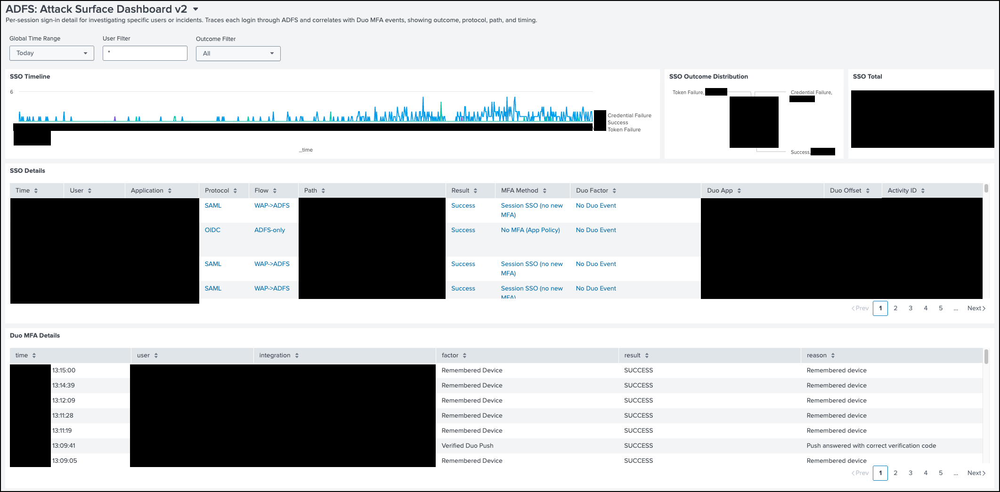

> **Production-grade Splunk dashboards for identity platform security
> monitoring (ADFS, Duo, Okta), with the export/import and drift-detection
> tooling needed to keep dashboards version-controlled at scale.**

# Splunk

Splunk dashboard portfolio and automation for identity platform security monitoring — covering ADFS, Okta, and Duo activity, with cross-platform views for the ongoing ADFS → Okta migration. Export, backup, restore, and version control of dashboards across Production and Development environments.



---

### About this repo

This is a sanitized snapshot of internal tooling, published via an
automated review-and-publish pipeline. Internal identifiers
(subscription IDs, resource group names, internal hostnames, email
addresses) are deliberately replaced with placeholders like
`your-subscription-id`, `your-acr-name`, and `your-org`. Replace
these with values appropriate to your environment when adapting
the code.

---

## Overview

Splunk's UI offers no easy way to version-control dashboards. Drift between environments is hard to spot and harder to undo. This project gives Identity Engineers a CLI-driven workflow to:

* Export production dashboards to JSON
* Import / restore dashboards to a development environment
* Push exports through git for proper version control
* Detect drift between environments

The `Production Dashboards/` directory is the source of truth — its dashboard JSON files are what's currently live in production.

## Repository Layout

| Directory | Purpose |
|-----------|---------|
| `Production Dashboards/` | Live production dashboard JSON exports + lookups |
| `Development Dashboards/` | Development/staging variants — work-in-progress, not synced to prod |
| `Automation/` | Python and shell scripts that drive export, import, and dashboard lifecycle |

## Environments

| Env | Host | Folder |
|-----|------|--------|
| Production | `host.example.gov` | `Production Dashboards/` |
| Dev / Staging | `host.example.gov` | `Development Dashboards/` |

* App namespace: `search`
* Owner: `your-username`
* Language: Python 3

## Authentication

Auth is via **session cookie**, not Basic auth. The reverse proxy in front of Splunk blocks Basic auth challenges, and the Splunk REST API on ports 8089/8443 is firewalled externally on both farms — meaning all automation runs through the same web UI session a user would have.

The `Automation/` scripts handle cookie acquisition and refresh; see `Automation/setup_credentials.sh` for the initial setup.

## Production Dashboards

The `Production Dashboards/` folder contains JSON for every dashboard currently live in `host.example.gov`'s `search` app. Dashboard names indicate their domain (ADFS, Okta, Duo, etc.).

Lookups live in `Production Dashboards/lookups/` — CSVs and a `_lookup_definitions.json` describing each one.

## Automation

The `Automation/` folder ships:

* `export_dashboards.py` / `export_dashboards.sh` — pull live dashboards into JSON
* `import_dashboard.py` — push a JSON dashboard into a target Splunk env
* `splunk_query.py` — ad-hoc SPL execution wrapper
* `splunk_session.py` — cookie session management
* `setup_credentials.sh` — one-time credential bootstrap
* `test_connection.sh` — verify Splunk reachability + auth
* `build_dev_dashboards.py` — helper to derive dev variants from production

## Running

```bash
cd Automation
./setup_credentials.sh        # one-time
./test_connection.sh          # verify connectivity
./export_dashboards.sh        # pull current prod state
```

After export, the JSON files in `Production Dashboards/` reflect what's live; commit them to capture a snapshot.
